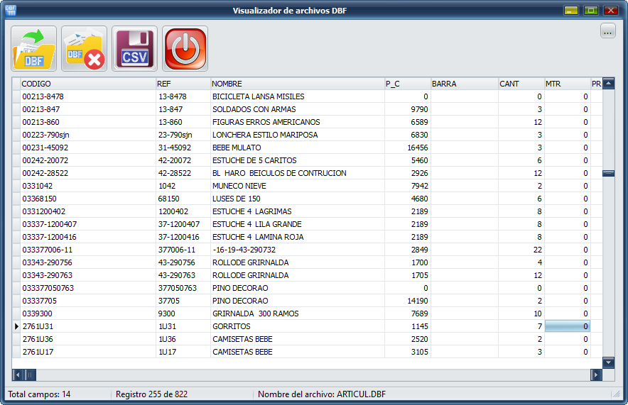
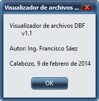

# Visualizador de archivos DBF

---
## Descripción
Visualizador de archivos *.dbf (DBase, FoxPro).

## Lenguaje/framework

* Lenguaje: Delphi. 
* Framework: VCL. 

---

## Autor

Ing. Francisco José Sáez Soto.

e-mail: **fjsaez@gmail.com**

LinkedIn: **linkedin.com/in/francisco-josé-sáez-soto**

GitHub: **github.com/fjsaez**

---

Calabozo (Venezuela), diciembre de 2010.

---

## Imágenes de la aplicación

### Icono

### Pantalla principal

### Acerca

